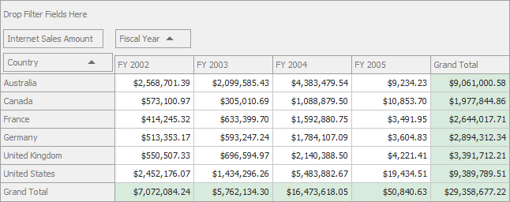

<!-- default badges list -->
[](https://supportcenter.devexpress.com/ticket/details/E3705)
[](https://docs.devexpress.com/GeneralInformation/403183)
<!-- default badges end -->

# Pivot Grid for WinForms - Bind to an OLAP Cube with the ADOMD.NET Data Provider

This example demonstrates how to specify connection settings to the Adventure Works cube on the OLAP server.



To bind the Pivot Grid control to an OLAP cube, follow the steps below.

1. Set the [PivotGridControl.OLAPDataProvider](https://docs.devexpress.com/WindowsForms/DevExpress.XtraPivotGrid.PivotGridControl.OLAPDataProvider) property to ADOMD.
2. Specify connection settings in the [PivotGridControl.OLAPConnectionString](https://docs.devexpress.com/WindowsForms/DevExpress.XtraPivotGrid.PivotGridControl.OLAPConnectionString) property. The following connection string is used in this example:
    ```
    OLAPConnectionString = "Data Source=http://demos.devexpress.com/Services/OLAP/msmdpump.dll;" +
                           "Initial Catalog=Adventure Works DW Standard Edition;Cube Name=Adventure Works;"
    ``` 
    Note that a valid connection string should provide the following parameters: Provider, Data Source, Initial Catalog, Cube Name.

## Files to Review

* [Form1.cs](./CS/XtraPivotGrid_ADOMD/Form1.cs) (VB: [Form1.vb](./VB/XtraPivotGrid_ADOMD/Form1.vb))

## Documentation

- [OLAP Mode](https://docs.devexpress.com/CoreLibraries/403809/devexpress-pivot-grid-core-library/pivot-grid-modes/olap-mode)
- [Binding to Data](https://docs.devexpress.com/WindowsForms/1842/controls-and-libraries/pivot-grid/binding-to-data)

## More Examples 

- [WPF Pivot Grid - Bind a PivotGrid to an OLAP Cube (.NET 6.0)](https://github.com/DevExpress-Examples/wpf-pivot-grid-connect-to-an-olap-cube-net6)
- [ASP.NET Pivot Grid - Bind a Pivot Grid to an OLAP Cube at Design Time](https://github.com/DevExpress-Examples/aspnet-pivot-grid-getting-started-bind-a-pivot-grid-to-an-olap-cube-runtime-sample-t540972)


